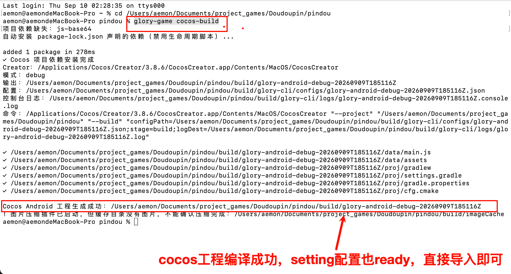

# \[202609\]cli 接入新工程开发指南

## cli 工具命令安装

- [https://github\.com/gnemyg7221/glory\-game\-cli](https://github.com/gnemyg7221/glory-game-cli) main分支

- 本地安装

```Plain Text
git clone git@github.com:gnemyg7221/glory-game-cli.git
cd glory-game-cli
npm install
npm link
```


## 已接入后的编译命令

### **命令 glory\-game cocos\-build**

这类项目都是我接入 SDK 后，你这边可以 git下来通过该命令编译 cocos项目，用来代替在 Creator 里点「构建 Android」，它只生成 Android 工程，输出目录：build/android\-20260909T185116Z


如果不用这个 cli，以前需要手动去 cocos编译，导入 Android 工程后，还需要手动跑一下这个脚本设置 setting依赖，现在用命令一步到位。


这个命令会做（参考）：

1. 读工程里的 `glory-game.yaml`（包名、竖屏、Creator 版本、AGP 等）

    1. 我接入 SDK 的已补充

2. 缺 `node_modules` 时按 lock 文件安装依赖

3. 调用本机对应版本的 Creator 构建 Android

    1. cocos配置、JDK、NDK 配置都在 `glory-game.yaml`

    2. 本机必须是 JDK 11、NDK 21\.4\.7075529，和 yaml 不一致命令会停

4. 检查 `main.js`、`assets`、`gradlew` 等产物是否齐

5. 自动改生成出来的 `proj`：挂上 `glory-adsdk`，并把 AGP/Gradle 钉成 yaml 里的 `7.4.2` / `7.6.3`，适配现有 SDK

    1. 这里的「挂上」是改 `proj/settings.gradle` 去引用模板里的 `cocos-settings.gradle`；SDK 子模块是接入时 apply 已经写进仓库的，这条命令不会重新 clone SDK

    2. 同时写入 `android.enableJetifier=true`、NDK 路径、JDK 11、`proj/.idea/vcs.xml`（Studio 顶栏要显示游戏仓和 glory\-adsdk）


#### 举例\-跑已经接过 SDK 的新游戏

https://github\.com/superWalnuts/Doudoupin


1. 下载 git 切到 feature/integrate\_ad\_sdk 分支

2. cli命令安装好后，在pindou文件夹下运行命令 `glory-game cocos-build`，



3. 导入工程即可，只打开最新一份 `build/android-时间戳/proj`


---

## 接入新工程命令

下面几个命令，乐佚日常可以不用；inspect 在工具链报错时可以用，init\-config 和 apply 是接入的时候用的

[glory\-game CLI 接入（以水果配为例）](https://gegameltd.feishu.cn/wiki/IUWIwjiboijkPwkDZPJc61XNnlj)

### **命令 glory\-game inspect**

不改游戏代码，只检查本机 Creator、JDK、NDK、CMake 和工程接入状态。`cocos-build` 报工具链不对时先跑这个。

```Plain Text
glory-game inspect
```

看输出里 Creator、JDK 11、NDK 21\.4\.7075529、CMake 3\.22\.1 是否 pass。Creator 模板可能显示 AGP 8 / JDK 17，那是 Creator 自带的，不要跟它走，生成工程仍按 yaml 钉死的 7\.4\.2 / 7\.6\.3。


### **命令 glory\-game init\-config**

接入时用。在游戏根目录生成 `glory-game.yaml`，只问包名。广告、隐私不要写进这个文件。

```Plain Text
glory-game init-config
```


生成后打开 yaml，确认：

1. `cocos.startScene` 是真正入口（不要落到空场景）

2. `android.ndkVersion` 是 `21.4.7075529`

3. `sdk.commit` 是 40 位 hash

对方电脑没有本机 Cocos `profiles/`，启动场景必须写在 yaml 里并提交。


### **命令 glory\-game apply**

接入时用。改 `native/engine/android` 模板：Manifest、Activity、Application、Gradle 模块表，并把 `glory-adsdk` 加成子模块、checkout 到 yaml 钉死的 commit。广告没填时宿主留空是正常的。


这条命令不会生成新的 `build/android-时间戳/proj`，也不会写 Jetifier、不会改 Studio 顶栏。那几件是 apply 之后再跑 `cocos-build` 才做的。


没有 `native/engine/android` 时，要先 `cocos-build` 一次出模板，再 apply，apply 完再 `cocos-build` 一次。

```Plain Text
glory-game apply
```


核对 SDK 版本（在游戏根目录执行）：

```Plain Text
git -C native/engine/android/glory-adsdk rev-parse HEAD
```


打印的 hash 必须等于 yaml 的 `sdk.commit`。apply 之后必须再跑一次 `cocos-build`，用新的 `proj` 打开。


